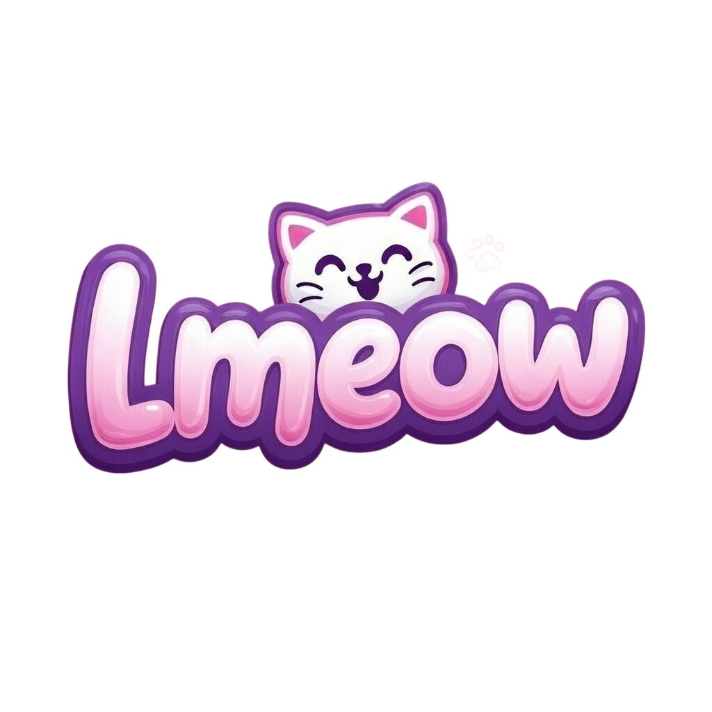

# 😸 Lmeow - Pet Coding Memes

<div align="center">
  
  
  ### LOL + MEOW = 😹
  
  > The #1 social platform for pet-loving developers! Create hilarious coding memes with cats 🐱 and dogs 🐶 only!
</div>


## 🎨 Brand Assets

The official Lmeow logo is located at:
```
public/lmeow-logo.png
```

Use it in components with:
```jsx

```

## ✨ Features

### 🐱🐶 Cats & Dogs Only!
- **NO generic images** - Every image/video shows real cats or dogs
- **Meme text overlays** - Classic Impact-style text on all content
- **Coding themed** - "Works on my machine", "cat.exe crashed", etc.

### 🎯 Core Features
- **Pet-First Profiles** - Spotlight your cat/dog with Dev Score & badges
- **Infinite Scroll Feed** - TikTok-style vertical feed with auto-play videos
- **AI Meme Generator** - Get coding caption suggestions based on your pet
- **Multi-Tab Discovery** - "For You", "Following", "Trending" feeds
- **Rich Engagement** - Paw likes, threaded comments, reposts, bookmarks

### 🎨 Design & UX
- **Vibrant Theme** - Pink/purple gradients with playful accents
- **Custom Fonts** - Fredoka (headings) + Poppins (body)
- **Impact Meme Text** - Classic white text with black outline
- **Dark/Light Mode** - Toggle between themes
- **Mobile-First PWA** - Optimized for phones

### 💰 Monetization Ready
- **Meme-Style Ads** - Brand-tagged posts with shop links
- **Meow Madness Challenges** - Brands create coding-themed challenges
- **Behavior Data** - Optional pet personality tracking

## 🚀 Quick Start

### Prerequisites
- Node.js 18+
- npm or yarn
- Firebase project (optional, has Demo Mode)

### Installation

```bash
# Navigate to project
cd "Pet Memes"

# Install dependencies
npm install

# Start development server
npm run dev
```

Open [http://localhost:5173](http://localhost:5173) to view the app.

### Demo Mode
Click "Try Demo Mode" on the login screen to explore without setting up Firebase!

## 🖼️ Logo Usage

The Lmeow logo appears in:
- ✅ Splash screen (large, animated)
- ✅ Login page (medium, animated)
- ✅ Home feed header (small)
- ✅ Browser favicon
- ✅ PWA manifest icons
- ✅ Empty states
- ✅ Demo mode button

## 📁 Project Structure

```
public/
├── lmeow-logo.png     # 🎨 Main logo!
├── manifest.json      # PWA config
└── ...

src/
├── components/
│   ├── feed/          # FeedCard with meme text
│   ├── navigation/    # BottomNav
│   └── ui/            # ToastContainer
├── data/
│   └── demoData.js    # All cats & dogs demo content
├── pages/
│   ├── Splash.jsx     # Logo splash screen
│   ├── Home.jsx       # Feed with logo header
│   ├── auth/Login.jsx # Login with logo
│   └── ...
└── index.css          # Meme text styling
```

## 🛠 Tech Stack

| Category | Technology |
|----------|------------|
| Frontend | React 19, Vite 7 |
| Styling | Tailwind CSS 4 |
| State | Zustand |
| Animations | Framer Motion |
| Icons | Lucide React |
| Backend | Firebase (Auth, Firestore, Storage) |
| AI | Google Gemini via OpenRouter (optional) |
| Images | cataas.com (cats), placedog.net (dogs) |

## 🎨 Meme Text Styling

All memes use classic Impact-style text:

```css
.meme-text {
  font-family: 'Impact', sans-serif;
  text-transform: uppercase;
  color: white;
  text-shadow: -3px -3px 0 #000, 3px -3px 0 #000...;
  -webkit-text-stroke: 2px black;
}
```

## 📱 Demo Memes

| Pet | Meme Text |
|-----|-----------|
| 🐱 Debug McWhiskers | "WORKS ON MY MACHINE" |
| 🐶 Bork Overflow | "DEPLOYED TO PROD - ZERO ERRORS" |
| 🐱 Null Pointer | "CAT.EXE HAS STOPPED WORKING" |
| 🐶 API Boi | "WHEN THE API FINALLY FETCHES" |
| 🐱 Keyboard Destroyer | "FIXING CODE BY SITTING ON KEYBOARD" |
| 🐶 Force Pusher | "GIT PUSH --FORCE - NO REGRETS" |

## 📄 License

MIT License - feel free to use for your own projects!

## 🤝 Contact

Built by **@adriannewman21** from Hong Kong 🇭🇰

---

<div align="center">
  
  <br/>
  <em>Made with ❤️ and lots of 🐾 paw taps</em>
  <br/>
  <strong>🐱 + 🐶 + 💻 = 😹</strong>
</div>
